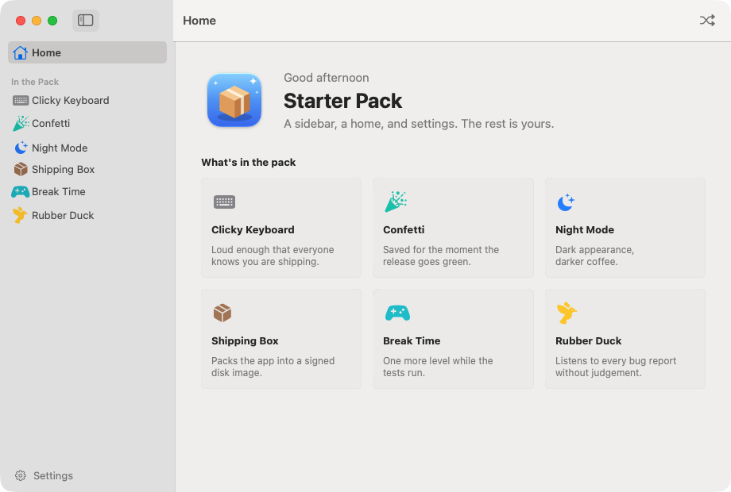

# Starter

A small native macOS app template: a sidebar, a home screen and settings, plus the tests, CI
checks and signed release pipeline to ship it.

<p align="center">
  <picture>
    <source media="(prefers-color-scheme: dark)" srcset="docs/images/home-dark.png">
    
  </picture>
</p>

## What's inside

- A native SwiftUI app: a `NavigationSplitView` sidebar, a home screen, detail pages, a tabbed
  Settings window, and a Pack menu that shuffles with Command-R.
- Zero dependencies. The release binary is about 160 KB, and `make verify` fails the build if it
  grows past a 500 KB budget.
- A Swift Testing suite covering the models, the store, and that every screen lays out.
- CI on every pull request: lint, a no-comments check, tests, a release build, bundle
  verification, and a DMG you can download from the run.
- Hygiene and security workflows: YAML, Markdown, links, workflow linting, gitleaks, semgrep,
  trivy, dependency review and OpenSSF Scorecard.
- A Release workflow that runs on every push to `main` that touches the app and versions, builds, signs, packages and publishes a DMG with its
  checksum to GitHub Releases.
- Signing that works with or without an Apple Developer account: ad-hoc out of the box, your own
  self-signed or Apple identity when you have one, and notarization with a Developer ID.

## Use this template

1. Click **Use this template** on GitHub and create your repository.
2. Clone it and give the app its own name and bundle identifier:

   ```sh
   git clone https://github.com/you/your-app.git
   cd your-app
   make rename NAME=MyApp BUNDLE_ID=com.example.myapp
   ```

3. Build and launch it:

   ```sh
   make run
   ```

## Requirements

- macOS 15 or later
- Xcode 16 or later (Swift 6). The Makefile uses `/Applications/Xcode*.app` when `xcode-select`
  points at the Command Line Tools.

## Commands

| Command | What it does |
| --- | --- |
| `make run` | Debug build of `dist/<App>.app`, then launch it |
| `make build` | Debug build without launching |
| `make build-release` | Optimized, stripped release build |
| `make test` | Run the Swift Testing suite |
| `make lint` / `make format` | Check or apply `swift format` |
| `make comments` | Fail on code comments |
| `make verify` | Check the built bundle: executable, Info.plist, icon, signature, size budget |
| `make dmg` | Release build, verify, then package a signed DMG and its SHA-256 |
| `make ci` | `lint`, `comments`, `test` and `dmg`, the same checks CI runs |
| `make ci-hygiene` | yamllint, markdownlint, actionlint, zizmor and lychee |
| `make ci-security` | gitleaks, semgrep and trivy |
| `make ci-all` | Everything above |
| `make tools` | Install the hygiene and security tools with Homebrew |
| `make release BUMP=patch` | Run the Release workflow on GitHub (`patch`, `minor` or `major`) |
| `make rename NAME=... BUNDLE_ID=...` | Rename the app and set its bundle identifier |
| `make icon` | Render `Resources/AppIcon.svg` into `Resources/AppIcon.icns` with headless Chrome |
| `make signing` | Show which identity builds sign with and what releases will do |
| `make signing-create`, `-import`, `-secrets`, `-reset` | Manage signing, see [docs/signing.md](docs/signing.md) |
| `make clean` | Remove `.build` and `dist` |

## Project layout

| Path | Contents |
| --- | --- |
| `Package.swift` | The SwiftPM package; `appName` sets the executable name |
| `Sources/Main` | The `@main` app entry point |
| `Sources/AppCore/Model` | Things, the pack, greetings, preferences and the observable store |
| `Sources/AppCore/Views` | Root split view, sidebar, home, detail and settings screens |
| `Tests/AppCoreTests` | Swift Testing suites |
| `Resources` | `Info.plist`, the app icon and its SVG source |
| `scripts` | Signing, verification, packaging, versioning, renaming and the comment check |
| `.github/workflows` | CI, hygiene, security, pull request title and release workflows |
| `docs` | Signing guide and screenshots |

## Signing and releases

Every push to `main` that changes the app, its resources, or the build scripts cuts a patch release automatically. For a minor or major bump, run the **Release** workflow from the Actions tab (or `make release BUMP=minor`). It picks the next version
from the latest `v*` tag, runs the tests, builds and verifies the app, packages the DMG and
publishes it with a `.sha256` file to GitHub Releases.

With no secrets configured the release is signed ad-hoc and still works. Add a certificate as
repository secrets and the same workflow signs with it; add a Developer ID certificate and an App
Store Connect API key and it also notarizes. [docs/signing.md](docs/signing.md) walks through each
option and the helper commands that set them up.

## Checks

| Workflow | Runs on | What it checks |
| --- | --- | --- |
| `ci.yml` | Pull requests, pushes to `main` | Lint, no comments, tests, release build, bundle verification, DMG artifact, and a signed build with a throwaway identity |
| `hygiene.yml` | Pull requests, pushes to `main` | Required community files, YAML, Markdown, actionlint, zizmor and links |
| `security.yml` | Pull requests, pushes to `main`, weekly | gitleaks, semgrep, trivy, dependency review and OpenSSF Scorecard |
| `pr.yml` | Pull requests | Conventional pull request titles |
| `release.yml` | Manual | Versioned, signed and optionally notarized release |
| `dependabot.yml` | Weekly | Keeps the pinned GitHub Actions up to date |

## License

[MIT](LICENSE)
